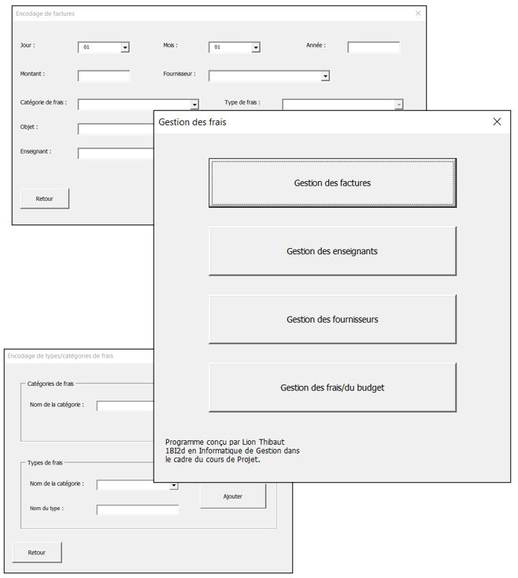
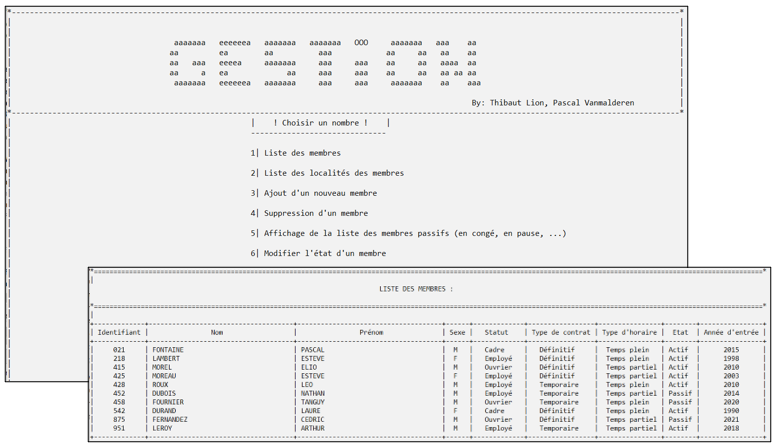
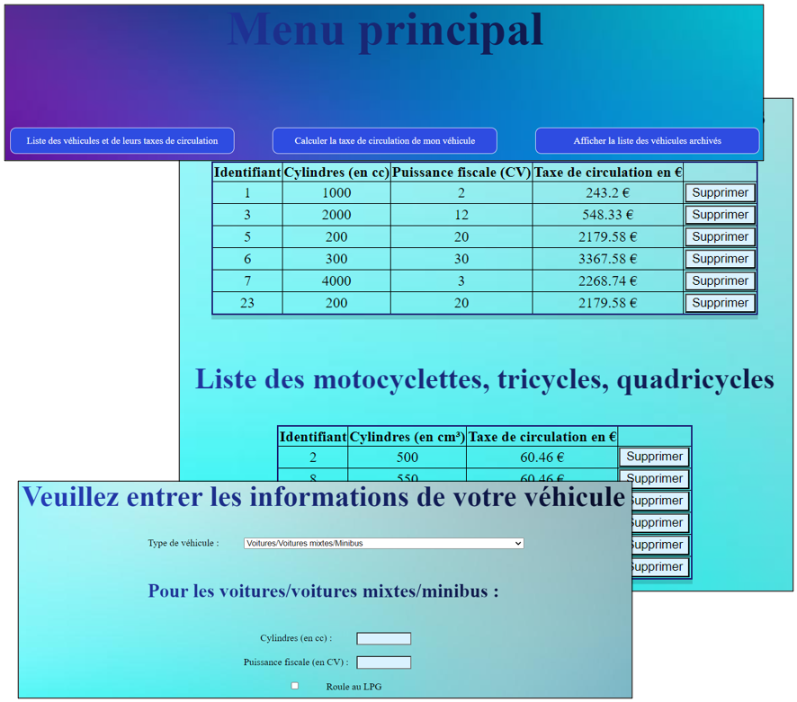
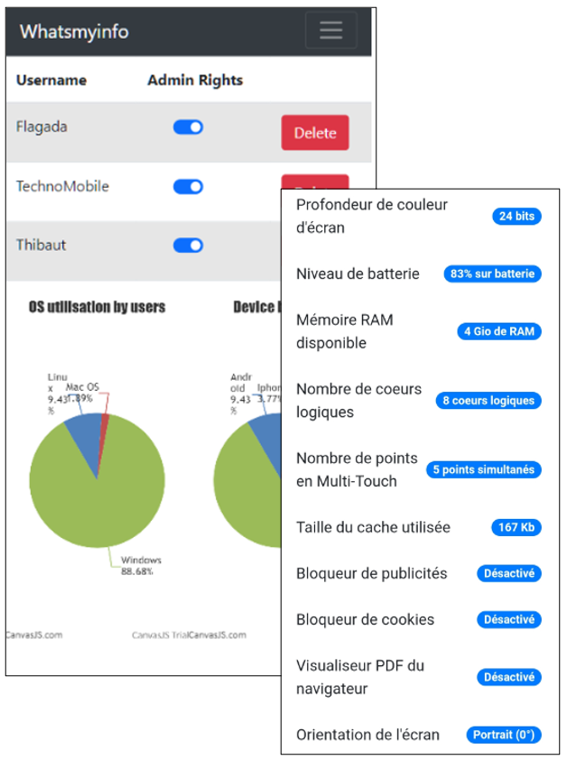
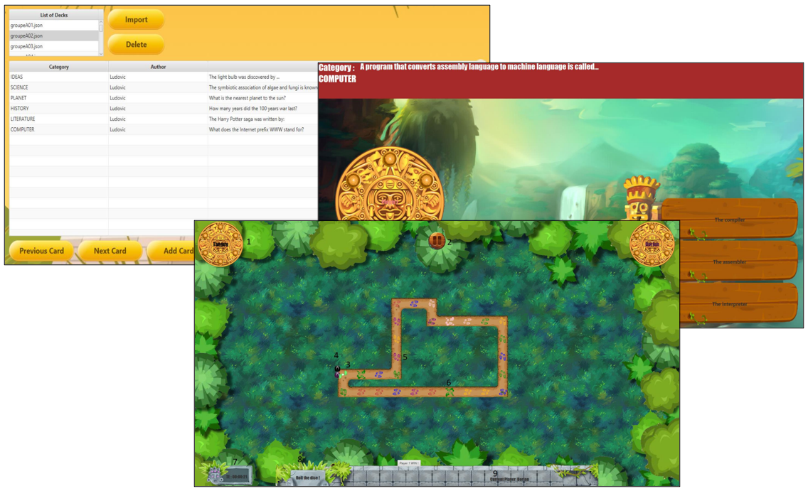
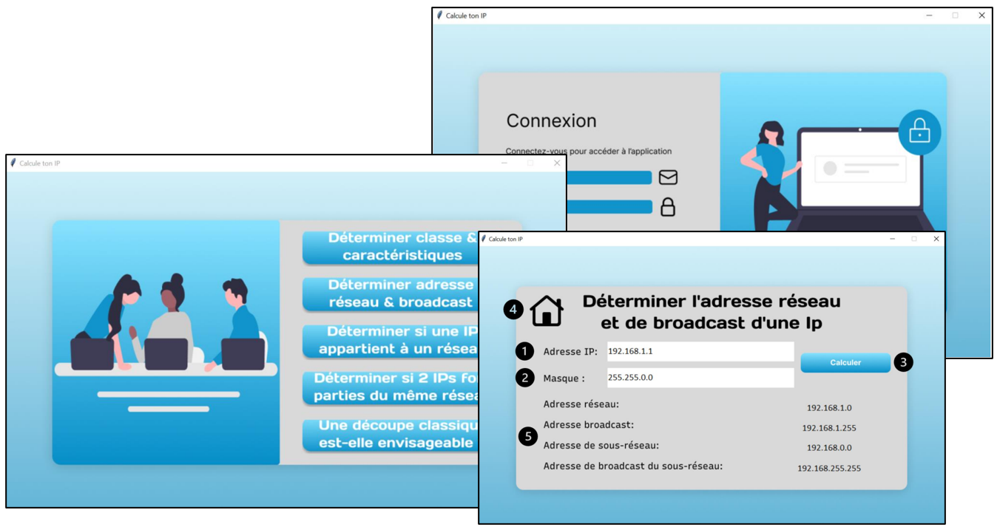
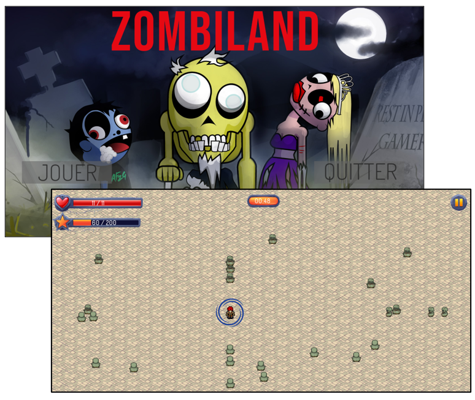
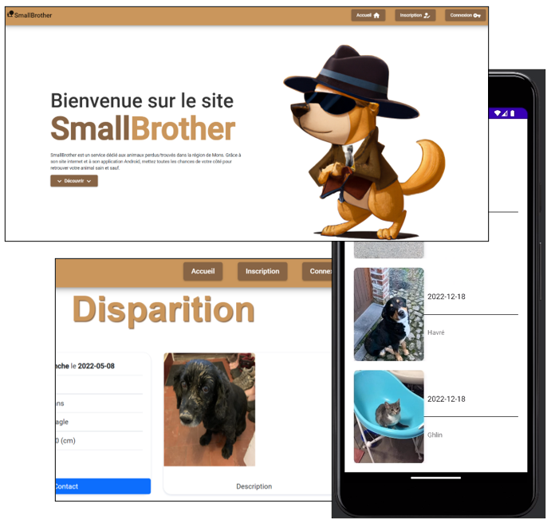
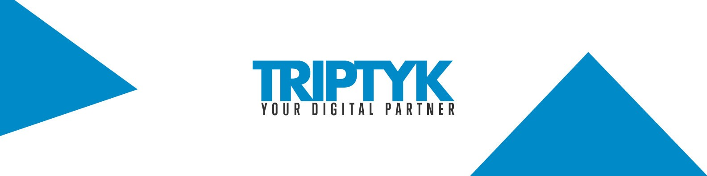

# Mes projets scolaires
## Bloc 1
### Gestionnaire des frais et ressources de la HELHa 🧰
- **Objectif :** Création d'une application permettant la gestion des frais et des différentes ressources du Département économique de la HELHa de Mons (professeurs, fournisseurs, budgets, ...). Utilisation réservée au secrétariat de la section. Mise en place d'une interface graphique efficace pour l'utilisateur.
- **Technologies utilisées :** Excel, VBA (Visual Basic for Applications)
- **Aperçu du projet :**
  
  
  
## Bloc 2
### Gestionnaire des ressources humaines d'une entreprise 🤝
- **Objectif :** Gestionnaire des employés (salaires, fonctions, horaires, ...) d'une entreprise. Obtention de bilans et de statistiques sur les données.
- **Technologies utilisées :** C (en invite de commande)
- **Aperçu du projet :**

  

### Gestionnaire de véhicules et calculatrice de taxes 🚗
- **Objectif :** Gestionnaire d'archivage de séries de véhicules de tous types avec ajout de son propre véhicule. Possibilité de calculer le coût de la taxe de circulation pour chaque véhicule en fonction de ses caractéristiques et des réglementations locales.
- **Technologies utilisées :** XML, PHP, HTML/CSS, XSL, JavaScript
- **Aperçu du projet :**

  

### Site internet de récupération de données (WhatsMyInfo) 🔢
- **Objectif :** Site internet ayant pour objectif d'afficher toutes les données de l'utilisateur récupérables par navigateur. Cela permet de présenter la quantité d'informations accessibles de cette manière et de sensibiliser à ce sujet. Grâce à une utilisation sur mobile, d'autres types d'informations sont concernées (gyroscope, localisation, accéléromètre, ...). Création de comptes pris en charge afin d'en conclure des statistiques diverses. Gestionnaire d'administration compris également.
- **Technologies utilisées :** PHP, MySQL, HTML, JQuery, Bootstrap
- **Aperçu du projet :**

  

### Jeu de plateau de culture générale (Jungle Quizz) 🎲
- **Objectif :** Jeu de plateau au tour par tour pour plusieurs joueurs en local. Jeu contenant des pions sur un plateau basé sur des cartes de questions de cultures générales pour avancer. Très modulable avec la possibilité d'ajouter de nouvelles catégories de questions ou de jouer avec ses propres questions. Le tout est disposé au sein d'une interface graphique (JavaFX) pour visualiser l'avancée de la partie, les scores ou encore le plateau généré de manière procédurale à chaque partie.
- **Technologies utilisées :** Java, JavaFX
- **Aperçu du projet :**

  

## Bloc 3
### Gestionnaire de réseaux informatiques et d'adresses IP
- **Objectif :** Gestionnaire proposant des fonctionnalités de calculs sur des caractéristiques de réseaux informatiques diverses. Celui-ci propose, entre autres, de déterminer les caractéristiques d'une IP entrée, l'appartenance d'une IP à un réseau ou encore des possibilités de découpes d'un réseau informatique. Une interface intuitive propose ces différentes opérations à l'utilisateur de manière lisible (Tkinter). De plus, un système de connexion sécurisée y est présent.
- **Technologies utilisées :** Python, Tkinter
- **Aperçu du projet :**

  
  
### Jeu vidéo de type "Vampire Survivors" (Zombiland) 🧟
- **Objectif :** Jeu vidéo en 2 dimensions avec pour objectif de faire survivre notre personnage le plus longtemps possible au sein de hordes de zombies. Jeu à accumulation de scores avec un système de vie et d'expérience pour le joueur.
- **Technologies utilisées :** C++, SFML
- **Aperçu du projet :**

  

### Site internet et application mobile pour animaux disparus 🐕
- **Objectif :** Site internet complet (du backend au frontend) permettant de centraliser les animaux perdus de la région de Mons. Un grand nombre de fonctionnalités est proposé afin de déclarer des animaux perdus ou retrouvés et d'en informer les propriétaires. Le tout est disponible au sein de différents fils d'actualités. De plus, le site dispose d'une application mobile permettant de profiter de fonctionnalités inédites grâce à ce support (localisation, notifications, ...).
- **Technologies utilisées :** Angular/TypeScript, .Net/C#, Microsoft SQL Server, Kotlin
- **Aperçu du projet :**

  

### Projets de stage de fin d'études (Triptyk) 🏢
- **Objectif :**  Stage d’une durée de quinze semaines, en immersion au sein d’une PME faisant office d’agence web du nom de Triptyk S.P.R.L. C’est dans le cadre de la fin d’un bachelier en informatique de gestion que ce stage et cette réalisation se sont dessinés. L’apprentissage et l’autonomie ont été les maîtres-mots de cette période en s’immergeant, comme un employé de l’entreprise, au travail du quotidien et à la vie commune de Triptyk. Triptyk est une entreprise spécialisée dans le développement de logiciels et d’intranets. Le travail majeur s'est donc porté sur la réalisation d'intranets sur mesure pour entreprises gérant la médiation de dettes, servant de gestionnaire pour entreprise logistique et bien d'autres encore.
- **Technologies principalement utilisées :** Ember JS/TypeScript, PostgreSQL, HTML/CSS

  
